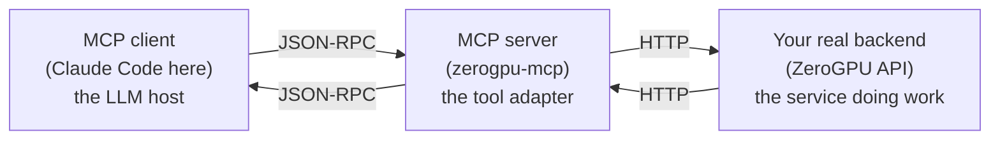
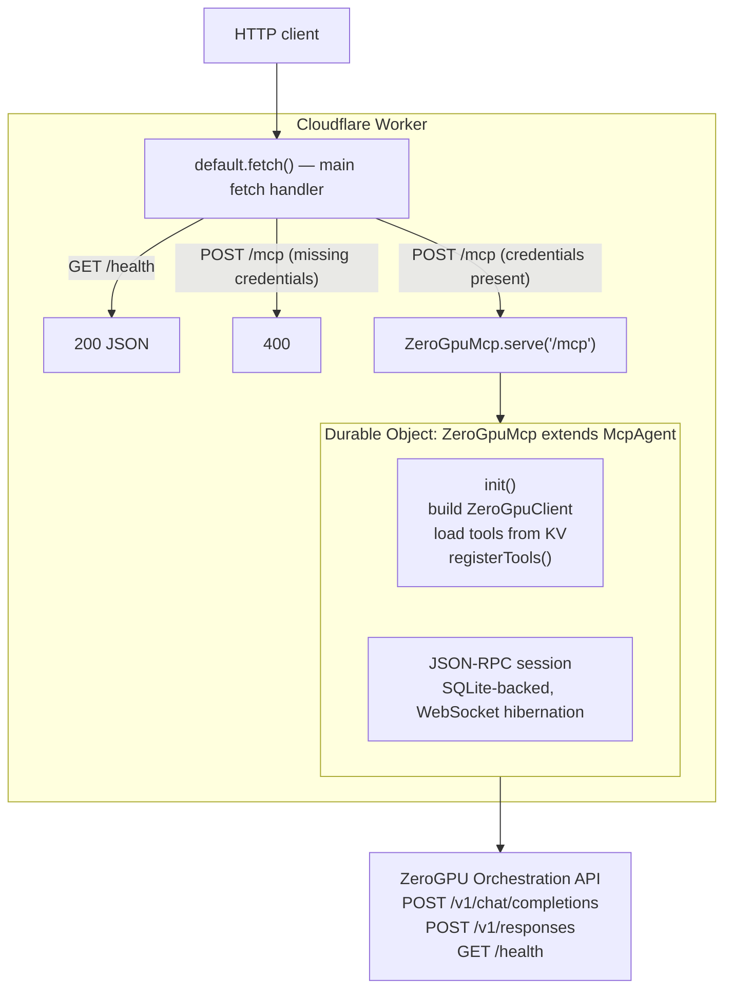
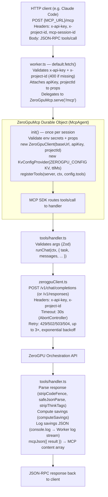
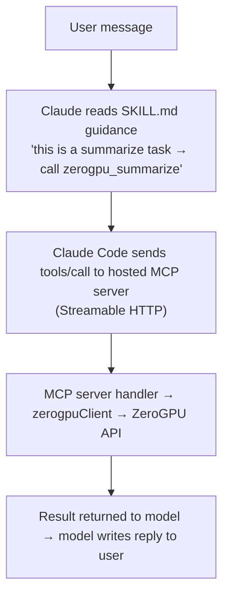

# ZeroGPU Router

Reduce your AI costs

[](README.md)
[](https://github.com/zerogpu/ZeroGPU-Router/actions/workflows/ci.yml)
[](LICENSE)
[](mcp-server/)
[](openclaw-plugin/)

## What is ZeroGPU Router?

ZeroGPU Router is a smart task router for agents. It redirects cheap, narrow AI work to small language models (SLMs), so your premium model can stay focused on reasoning, coding, planning, and orchestration.

Instead of asking the host model to summarize, classify, redact PII, extract JSON, or generate simple follow-up questions, ZeroGPU Router exposes task-specific MCP tools backed by the **ZeroGPU Orchestration API**.

- 🔀 Route small tasks to SLMs through MCP tools
- 🎛️ Use from OpenClaw, Claude Code, or any Streamable HTTP MCP client
- 📊 Track model usage, latency, estimated cost, and savings on every call
- 🚑 Keep premium host models available for complex reasoning and fallback
- 🔐 Pass ZeroGPU credentials per client request; the hosted Worker does not store user API keys

## Quick Start

### OpenClaw

Register your deployed ZeroGPU Router MCP endpoint:

```sh
openclaw mcp set zerogpu '{
  "url": "https://<your-worker-host>/mcp",
  "transport": "streamable-http",
  "headers": {
    "x-api-key": "<your-api-key>",
    "x-project-id": "<your-project-id>"
  }
}'
```

Install the OpenClaw plugin:

```sh
cd openclaw-plugin/plugin
npm install
npm run build
openclaw plugins install ./
```

Then ask your agent:

```text
summarize this paragraph: Renewable energy adoption is accelerating globally, driven by falling solar and wind costs.
```

The agent should call `zerogpu_summarize` and return a summary with model usage and savings metadata.

### Claude Code

Register the hosted MCP server:

```sh
claude mcp add --transport http zerogpu \
  https://<your-worker-host>/mcp \
  --header "x-api-key: <your-api-key>" \
  --header "x-project-id: <your-project-id>"
```

Then install the skill-only Claude plugin from [claude-plugin/](claude-plugin/), so Claude knows when to call the `zerogpu_*` tools.

### Self-hosted Worker

ZeroGPU Router ships as a Cloudflare Worker MCP server:

```sh
cd mcp-server
npm install
npm run worker:types
npm run kv:seed:develop
npm run deploy:develop
```

Set `ZEROGPU_ORCHESTRATION_URL` as a Worker secret. Clients send `x-api-key` and `x-project-id` on each `/mcp` request.

## Routes

ZeroGPU Router exposes eleven task-specific routes:

| Route | Workload | SLM / backend model |
|---|---|---|
| `zerogpu_classify_iab` | IAB topic classification | `zlm-v1-iab-classify-edge` |
| `zerogpu_summarize` | TL;DRs, short abstracts, meeting note summaries | `t5-small` |
| `zerogpu_classify_zero_shot` | Classify text against a flat label list | `deberta-v3-small` |
| `zerogpu_extract_entities` | Extract people, places, companies, dates, custom entities | `gliner2-base-v1` |
| `zerogpu_extract_json` | Pull structured fields into grouped JSON | `gliner2-base-v1` |
| `zerogpu_classify_structured` | Multi-axis schema classification | `gliner2-base-v1` |
| `zerogpu_redact_pii` | Mask emails, phones, names, addresses, and other PII | `gliner-multi-pii-v1` |
| `zerogpu_extract_pii` | Extract PII grouped by category | `gliner-multi-pii-v1` |
| `zerogpu_generate_followups` | Generate follow-up questions from a passage | `zlm-v1-followup-questions-edge` |
| `zerogpu_chat` | Short small-model chat replies | `LFM2.5-1.2B-Instruct` / `-Thinking` |
| `zerogpu_health` | Verify ZeroGPU backend health | ZeroGPU `/health` |

## Packages

ZeroGPU Router ships as three artifacts that work together:

| Package | Role |
|---|---|
| [mcp-server/](mcp-server/) | TypeScript MCP server for Node stdio or Cloudflare Workers |
| [openclaw-plugin/](openclaw-plugin/) | OpenClaw plugin and skill for task routing |
| [claude-plugin/](claude-plugin/) | Claude Code skill plugin for routing guidance |

## Quick Links

- [OpenClaw setup](openclaw-plugin/README.md)
- [MCP server package](mcp-server/README.md)
- [Release guide](RELEASE.md)
- [Contributing](CONTRIBUTING.md)
- [Security](SECURITY.md)
- [License](LICENSE)

---

## Table of contents

- [What is ZeroGPU Router?](#what-is-zerogpu-router)
- [Quick Start](#quick-start)
- [Routes](#routes)
- [Packages](#packages)
- [Quick Links](#quick-links)
- [What is MCP?](#what-is-mcp)
- [What is a Skill?](#what-is-a-skill)
- [How the Cloudflare Worker MCP works end-to-end](#how-the-cloudflare-worker-mcp-works-end-to-end)
  - [Architecture](#architecture)
  - [Health check: GET /health](#health-check-get-health)
  - [Initialize a session: POST /mcp — initialize](#initialize-a-session-post-mcp--initialize)
  - [List tools: POST /mcp — tools/list](#list-tools-post-mcp--toolslist)
  - [Call a tool: POST /mcp — tools/call](#call-a-tool-post-mcp--toolscall)
  - [Internal call flow, layer by layer](#internal-call-flow-layer-by-layer)
- [Connecting the MCP: external integration overview](#connecting-the-mcp-external-integration-overview)
- [OpenClaw plugin](#openclaw-plugin)
- [The Claude Code plugin](#the-claude-code-plugin)
  - [plugin.json — the manifest](#pluginjson--the-manifest)
  - [SKILL.md — the guidance layer](#skillmd--the-guidance-layer)
  - [How they wire together](#how-they-wire-together)
- [Step-by-step: connect Claude Code to the hosted Cloudflare Worker](#step-by-step-connect-claude-code-to-the-hosted-cloudflare-worker)
- [Tools reference](#tools-reference)
- [Troubleshooting](#troubleshooting)

---

## What is MCP?

**MCP (Model Context Protocol)** is a small, open protocol that lets an AI assistant call external tools in a standard way. Think of it as "USB for LLMs": any app that speaks MCP can plug into any AI client that speaks MCP.

Conceptually there are three actors:



- **MCP client** — the app hosting the LLM (Claude Code, Claude Desktop, Cursor, etc.). It asks the server "what tools do you have?", then calls them on the model's behalf.
- **MCP server** — a small program that advertises a set of **tools** and responds to invocations. Each tool has a name, a description, a JSON-schema for its arguments, and a handler.
- **Transport** — how the two talk. MCP defines two common transports:
  - **stdio** — the client *spawns* the server as a child process and pipes JSON-RPC over stdin/stdout. Used for locally installed servers.
  - **HTTP (Streamable HTTP)** — the server listens on a URL, the client POSTs JSON-RPC messages to it. Used for remote/hosted servers.

A typical call flow when the user asks Claude to "summarize this paragraph":

1. Claude Code lists the server's tools at startup (result: eleven `zerogpu_*` tools become visible to the model).
2. The model decides to call `zerogpu_summarize` with `{ text: "..." }`.
3. Claude Code sends a `tools/call` JSON-RPC request to the server over stdio (or HTTP).
4. The server's handler runs, calls the ZeroGPU backend, parses the response, and returns a JSON blob.
5. Claude Code feeds the result back into the model, which writes a reply to the user.

The model never sees the ZeroGPU API key, the retry logic, or the model-routing table — the MCP server is an opaque layer.

---

## What is a Skill?

A **Skill** in Claude Code is a markdown file with YAML frontmatter that tells Claude *when* to do something. It is pure prompt engineering — no code runs. Claude Code auto-loads all skills in your plugins/user/project directories and injects the relevant one into context when its trigger conditions look relevant.

The shape is always the same ([claude-plugin/plugins/zerogpu/skill/SKILL.md](claude-plugin/plugins/zerogpu/skill/SKILL.md)):

```markdown
---
name: zerogpu
description: Route cheap AI tasks ... to ZeroGPU models instead of spending Claude tokens.
---

# Body (plain markdown, read by the model as guidance)

## When to use ZeroGPU
...
## When NOT to use it
...
## Tool selection table
| User intent | Tool | Notes |
| ... | ... | ... |
```

The frontmatter is intentionally minimal — `name` and `description` are all the skill needs. The MCP server is the source of truth for which tools exist; whichever tools it registers become callable by the agent client under that MCP server's configured name (for example, a server named `zerogpu` exposes `zerogpu_summarize`, `zerogpu_health`, and the rest of the `zerogpu_*` tool set). **The body is the actual guidance** — decision rules ("when the user says 'summarize', call `zerogpu_summarize`"), a tool-selection table, and worked examples.

**Skill vs. MCP server — the clean split:**

| | Skill | MCP server |
|---|---|---|
| What it is | Markdown file | Running program |
| What it does | Teaches Claude *when* to act | Defines *what* actions exist and runs them |
| When loaded | On conversation start (or when relevant) | Registered once; tools listed at startup |
| Runs code? | No | Yes |

---

## How the Cloudflare Worker MCP works end-to-end

### Architecture

The entire server is deployed as a single Cloudflare Worker. The main entry is [mcp-server/src/worker.ts](mcp-server/src/worker.ts), which exports a `fetch` handler and a Durable Object class. The `wrangler.toml` ties them together.



**Key source files:**

| File | Role |
|---|---|
| [src/worker.ts](mcp-server/src/worker.ts) | Fetch handler + Durable Object (`ZeroGpuMcp`) |
| [src/server.ts](mcp-server/src/server.ts) | `registerTools()` — shared by Worker and Node |
| [src/zerogpuClient.ts](mcp-server/src/zerogpuClient.ts) | HTTP client for ZeroGPU API (auth, retry, timeout) |
| [src/tools/\*.ts](mcp-server/src/tools/) | One handler per tool |
| [src/config.ts](mcp-server/src/config.ts) | `KvConfigProvider` — reads tool catalog from Cloudflare KV |
| [wrangler.toml](mcp-server/wrangler.toml) | Worker manifest (environments, Durable Object, KV binding) |

---

### Health check: GET /health

The health endpoint is unauthenticated and meant for monitoring systems and load balancers.

**Request:**
```http
GET {MCP_URL}/health
```

No headers required.

**Response (200):**
```json
{ "status": "ok", "env": "production" }
```

`env` reflects `ZEROGPU_MCP_ENV` from `wrangler.toml` (one of `develop`, `staging`, `production`, or `local` for `wrangler dev`).

**Internal flow:**

The fetch handler in [worker.ts:175–179](mcp-server/src/worker.ts#L175) matches `GET /health` before any credential check and returns immediately. No Durable Object is created. No KV is read.

---

### Initialize a session: POST /mcp — initialize

Every MCP session starts with an `initialize` handshake. This is the first request the client must send before listing or calling tools.

**Request:**
```http
POST {MCP_URL}/mcp
Content-Type: application/json
Accept: application/json, text/event-stream
x-api-key: <your-zerogpu-api-key>
x-project-id: <your-zerogpu-project-id>

{
  "jsonrpc": "2.0",
  "id": 1,
  "method": "initialize",
  "params": {
    "protocolVersion": "2024-11-05",
    "capabilities": {},
    "clientInfo": { "name": "my-client", "version": "1.0" }
  }
}
```

**Required headers:**

| Header | Value | Purpose |
|---|---|---|
| `Content-Type` | `application/json` | Tells the Worker to parse the body as JSON |
| `Accept` | `application/json, text/event-stream` | Declares support for both plain JSON and SSE streams |
| `x-api-key` | Your ZeroGPU API key | Forwarded to the ZeroGPU backend on every tool call |
| `x-project-id` | Your ZeroGPU project ID | Forwarded to the ZeroGPU backend on every tool call |

**Response (200):**
```json
{
  "jsonrpc": "2.0",
  "id": 1,
  "result": {
    "protocolVersion": "2024-11-05",
    "capabilities": { "tools": {} },
    "serverInfo": { "name": "zerogpu-mcp", "version": "0.1.0" }
  }
}
```

The response also carries an `mcp-session-id` header. You **must** include this header on every subsequent request in the same session.

**Internal flow:**

1. [worker.ts:188–196](mcp-server/src/worker.ts#L188) — the fetch handler reads `x-api-key` and `x-project-id` from headers. If either is missing, it returns 400 with a JSON-RPC error (`code: -32602`).
2. [worker.ts:200](mcp-server/src/worker.ts#L200) — the credentials are attached to the execution context as `props: { apiKey, projectId }`.
3. [worker.ts:204](mcp-server/src/worker.ts#L204) — `ZeroGpuMcp.serve("/mcp")` creates (or retrieves) a Durable Object instance for this session and routes the request to it.
4. The Durable Object's `init()` ([worker.ts:84–119](mcp-server/src/worker.ts#L84)) runs once per new session:
   - Validates that `ZEROGPU_ORCHESTRATION_URL` and the `ZEROGPU_CONFIG` KV binding are present.
   - Validates that `this.props.apiKey` and `this.props.projectId` are set.
   - Creates a `ZeroGpuClient` with those credentials.
   - Creates a `KvConfigProvider` that reads the tool catalog from KV.
   - Calls `registerTools()` which maps tool names to their handlers.
5. The MCP SDK (via `McpAgent`) replies with the `initialize` response and hands back the `mcp-session-id`.

---

### List tools: POST /mcp — tools/list

After initialization, the client discovers what tools are available.

**Request:**
```http
POST {MCP_URL}/mcp
Content-Type: application/json
Accept: application/json, text/event-stream
x-api-key: <your-zerogpu-api-key>
x-project-id: <your-zerogpu-project-id>
mcp-session-id: <session-id-from-initialize-response>

{
  "jsonrpc": "2.0",
  "id": 2,
  "method": "tools/list"
}
```

**Response (200):**
```json
{
  "jsonrpc": "2.0",
  "id": 2,
  "result": {
    "tools": [
      {
        "name": "zerogpu_health",
        "description": "Verifies the ZeroGPU Orchestration API is reachable...",
        "inputSchema": { "type": "object", "properties": {}, "required": [] }
      },
      {
        "name": "zerogpu_summarize",
        "description": "Summarize a passage with Google T5-small...",
        "inputSchema": {
          "type": "object",
          "properties": {
            "text": { "type": "string" },
            "max_tokens": { "type": "number" }
          },
          "required": ["text"]
        }
      }
      // ... seven more tools
    ]
  }
}
```

**Internal flow:**

The `mcp-session-id` header routes the request to the same Durable Object instance created during `initialize`. The MCP SDK (inside `McpAgent`) already has the registered tool list in memory from `init()`. It reads the registered tools and returns their names, descriptions, and input schemas. No KV or ZeroGPU backend calls happen.

---

### Call a tool: POST /mcp — tools/call

This is the main operation — asking the server to run a tool.

**Request:**
```http
POST {MCP_URL}/mcp
Content-Type: application/json
Accept: application/json, text/event-stream
x-api-key: <your-zerogpu-api-key>
x-project-id: <your-zerogpu-project-id>
mcp-session-id: <session-id-from-initialize-response>

{
  "jsonrpc": "2.0",
  "id": 3,
  "method": "tools/call",
  "params": {
    "name": "zerogpu_summarize",
    "arguments": {
      "text": "Artificial intelligence is transforming every industry..."
    }
  }
}
```

**Response (200) — success:**
```json
{
  "jsonrpc": "2.0",
  "id": 3,
  "result": {
    "content": [
      {
        "type": "text",
        "text": "{\"summary\":\"AI is transforming industries.\",\"model\":\"t5-small\",\"usage\":{\"prompt_tokens\":42,\"completion_tokens\":8},\"savings\":{\"zerogpu_cost_usd\":0.0000031,\"baseline_cost_usd\":0.000246,\"savings_usd\":0.000243}}"
      }
    ]
  }
}
```

**Response (200) — tool-level error (the MCP envelope is still 200):**
```json
{
  "jsonrpc": "2.0",
  "id": 3,
  "result": {
    "isError": true,
    "content": [
      {
        "type": "text",
        "text": "{\"error\":\"ZeroGPU upstream POST /v1/chat/completions failed: 401\"}"
      }
    ]
  }
}
```

**Internal flow (taking `zerogpu_summarize` as the example):**

1. The DO receives the `tools/call` JSON-RPC message over the session WebSocket.
2. The MCP SDK looks up `zerogpu_summarize` in the registered tool map and calls its handler.
3. [tools/summarize.ts](mcp-server/src/tools/summarize.ts) validates the arguments against its Zod schema, then calls `runChat()` from [tools/shared.ts](mcp-server/src/tools/shared.ts).
4. `runChat()`:
   - Loads the config (from the in-memory KV cache if TTL has not expired, otherwise re-fetches from KV).
   - Looks up the model for task `"summarize"` → `t5-small`, endpoint `"chat"`.
   - Prepends `"summarize: "` to the user text (T5 requires this prefix).
   - Calls `client.chatCompletions({ model: "t5-small", messages: [...] })`.
5. `ZeroGpuClient.chatCompletions()` in [zerogpuClient.ts:227](mcp-server/src/zerogpuClient.ts#L227):
   - POSTs to `{ZEROGPU_ORCHESTRATION_URL}/v1/chat/completions`.
   - Sets `content-type: application/json`, `accept: application/json`, `x-api-key`, `x-project-id`.
   - Uses an `AbortController` with a 30-second timeout.
   - On 429/502/503/504, retries up to 3 times with exponential backoff (`400ms × 2^attempt + 0–200ms jitter`).
   - On success (2xx), returns the parsed JSON response.
   - On failure, throws `ZeroGpuError` with the HTTP status and the first 500 characters of the response body.
6. Back in `runChat()`, the response content is extracted, savings are computed against the Claude baseline price table, and a savings JSON line is emitted to the Worker log stream (`console.log`).
7. The handler wraps the result in an MCP `content` array via `mcpJson()` and returns it.
8. The MCP SDK serializes the JSON-RPC response and sends it back to the client.

---

### Internal call flow, layer by layer



---

## Connecting the MCP: external integration overview

The `/mcp` endpoint speaks **JSON-RPC 2.0 over HTTP**. Any client that can issue HTTP POST requests and follow the session handshake can connect.

### What every client must do

1. **Send `x-api-key` and `x-project-id` on every request** — these are forwarded to the ZeroGPU backend and must match a valid ZeroGPU project.
2. **Start with `initialize`** — the server will reject `tools/list` and `tools/call` before initialization.
3. **Carry the `mcp-session-id`** — the header returned by `initialize` must be sent on every follow-up request in the same session. Without it, the Worker routes the request to a fresh DO instance which will error.
4. **Set `Accept: application/json, text/event-stream`** — required by the Streamable HTTP transport. Plain `application/json` alone will be rejected by the MCP SDK.

### Connection methods

| Client type | How to connect |
|---|---|
| **Claude Code** | `claude mcp add --transport http <name> {MCP_URL}/mcp --header "x-api-key: ..." --header "x-project-id: ..."` |
| **cURL / REST tools** | Three-step flow: health check → initialize → tools/list or tools/call (manually carry session ID) |
| **MCP Inspector** | Set server URL to `{MCP_URL}/mcp`, add custom headers in the UI |
| **Any MCP SDK client** | Pass `{MCP_URL}/mcp` as the SSE/HTTP endpoint; inject the two credential headers |
| **Postman** | Pre-request script that carries `mcp-session-id` between requests |

### What you never need to share

The Worker does not use or expose a separate bearer token for the `/mcp` endpoint — access is controlled entirely by the `x-api-key` and `x-project-id` headers that gate the underlying ZeroGPU API. Rotate those headers to revoke access.

> **Note on the `/health` endpoint:** `GET {MCP_URL}/health` requires *no* credentials and returns `{ "status": "ok", "env": "..." }`. Use it as a low-cost probe to verify the Worker is deployed and reachable before starting an MCP session.

---

## OpenClaw plugin

The OpenClaw integration lives in [openclaw-plugin/](openclaw-plugin/) and is the recommended agent packaging for this repository.

It has two parts:

| File | Role |
|---|---|
| [openclaw-plugin/mcp/zerogpu-server.json](openclaw-plugin/mcp/zerogpu-server.json) | Example payload for `openclaw mcp set zerogpu` |
| [openclaw-plugin/plugin/openclaw.plugin.json](openclaw-plugin/plugin/openclaw.plugin.json) | Plugin manifest that declares the ZeroGPU skill |
| [openclaw-plugin/plugin/skills/zerogpu/SKILL.md](openclaw-plugin/plugin/skills/zerogpu/SKILL.md) | Routing guidance that tells the agent when to call `zerogpu_*` tools |
| [openclaw-plugin/plugin/src/index.ts](openclaw-plugin/plugin/src/index.ts) | Minimal plugin entry; skills load declaratively from the manifest |

### Register the remote MCP server

```sh
openclaw mcp set zerogpu '{
  "url": "https://<your-worker-host>/mcp",
  "transport": "streamable-http",
  "headers": {
    "x-api-key": "<your-api-key>",
    "x-project-id": "<your-project-id>"
  }
}'

openclaw mcp show zerogpu --json
```

### Install the plugin from source

```sh
cd openclaw-plugin/plugin
npm install
npm run build
openclaw plugins install ./
openclaw plugins list
```

The skill frontmatter includes OpenClaw metadata that requires the `zerogpu` MCP server, so the routing guidance is only active when the MCP dependency is present.

---

## The Claude Code plugin

### plugin.json — the manifest

[claude-plugin/plugins/zerogpu/.claude-plugin/plugin.json](claude-plugin/plugins/zerogpu/.claude-plugin/plugin.json) is the primary manifest Claude Code reads when it installs the plugin. The public package is skill-only by default:

```json
{
  "name": "zerogpu",
  "version": "0.1.0",
  "skills": ["./skill"]
}
```

**`skills`** — a list of relative paths to skill folders. Claude Code finds `SKILL.md` inside each folder and loads its content into context.

The MCP server is registered separately with `claude mcp add --transport http`. This avoids starting a second local stdio server when the hosted Worker is already configured.

### SKILL.md — the guidance layer

[claude-plugin/plugins/zerogpu/skill/SKILL.md](claude-plugin/plugins/zerogpu/skill/SKILL.md) is a markdown file with YAML frontmatter. Claude Code injects its body into the model's context when the skill is relevant.

```
---
name: zerogpu
description: Route cheap AI tasks to ZeroGPU models instead of spending Claude tokens.
---

# ZeroGPU offload guidance

## When to use ZeroGPU
Offload when the input is plain text and the task is one of:
classify / summarize / extract entities or JSON / redact or extract PII /
suggest follow-up questions / short chat.

## When NOT to use it
Keep in Claude when the task requires code, reasoning over prior messages, or long-form output.

## Tool selection table
| User intent | Tool |
| "Summarize this" | zerogpu_summarize |
| "Classify into IAB" | zerogpu_classify_iab |
| "Redact the PII" | zerogpu_redact_pii |
| ...               | ...                |

## Worked examples
...
```

**The body** is the decision logic — it tells the model when to route to ZeroGPU, which tool maps to which user intent, and what to do when a tool fails. The skill does not need an `allowed-tools` whitelist; whichever tools the MCP server registers under the `zerogpu` server name become available to the model automatically.

### How they wire together

When Claude Code starts a session with the plugin installed:

1. It reads `plugin.json` and loads `SKILL.md`.
2. Separately, Claude Code initializes the `zerogpu` MCP server you registered with `claude mcp add --transport http`.
3. It calls `tools/list` on that MCP server and registers the eleven `zerogpu_*` tools with the model.
4. When the user sends a message, the model checks the skill guidance. If the task fits ("summarize this paragraph"), the skill tells the model to call `zerogpu_summarize`.
5. Claude Code translates that into a `tools/call` JSON-RPC request and sends it to the hosted Worker MCP endpoint.
6. The server runs the handler, calls ZeroGPU, and returns the result.
7. Claude Code feeds the result back to the model, which writes its reply.



The skill and the server are deliberately decoupled: the skill is a text file (no code), the server is a running process. Updating tool descriptions requires only redeploying the server (or updating the KV catalog); the skill's routing table only needs updating when you add or remove whole tools.

---

## Step-by-step: connect Claude Code to the hosted Cloudflare Worker

This guide assumes the Worker is already deployed and you know its URL (`{MCP_URL}`) and your ZeroGPU credentials.

### Step 1 — verify the Worker is up

```bash
curl -s {MCP_URL}/health
```

Expected: `{"status":"ok","env":"production"}` (or `develop`/`staging`). If you get a network error, the Worker is not deployed or the URL is wrong. If you get `{"status":"ok"}` but `env` is missing, the `ZEROGPU_MCP_ENV` secret was not set.

### Step 2 — register the MCP server in Claude Code

Open a terminal and run:

```bash
claude mcp add --transport http zerogpu \
  {MCP_URL}/mcp \
  --header "x-api-key: <your-zerogpu-api-key>" \
  --header "x-project-id: <your-zerogpu-project-id>"
```

- `zerogpu` is the name Claude Code will use for this server. Tool names will appear as `mcp__zerogpu__zerogpu_summarize` etc.
- `--transport http` tells Claude Code to use the Streamable HTTP transport (not stdio).
- The `--header` flags are sent on every request to `/mcp`, including the `initialize` handshake.

Claude Code stores this registration in `~/.claude/settings.json` under `mcpServers`.

### Step 3 — install the skill (optional but recommended)

The skill is the guidance layer that tells Claude *when* to call ZeroGPU tools. Without it, the model has to infer when to use each tool from the tool descriptions alone.

**3a.** Register the marketplace (substitute your repo path):

```
/plugin marketplace add <path-to-repo>/claude-plugin
```

**3b.** Install the plugin:

```
/plugin install zerogpu@zerogpu-local
```

The plugin manifest is skill-only, so it will not start a second local stdio server. It will use the hosted `zerogpu` MCP server you registered in Step 2.

### Step 4 — restart Claude Code

Close and reopen the Claude Code CLI (or your IDE extension). Plugin registration and MCP session initialization happen at session start.

### Step 5 — verify the connection

Inside the new session:

```
/mcp
```

The `zerogpu` server should appear in the list with status **connected** and eleven tools visible.

### Step 6 — smoke test

Run the health tool:

```
Run the zerogpu health tool.
```

Claude should call `mcp__zerogpu__zerogpu_health`, which hits `{MCP_URL}/mcp` → Worker → ZeroGPU `/health` → returns status.

Test a real task:

```
Summarize this: "Renewable energy adoption is accelerating globally, driven by falling solar and wind costs."
```

The skill guidance should steer the model to call `zerogpu_summarize` instead of answering directly. The reply will include the summary and a savings estimate.

### Step 7 — check Worker logs (optional)

Every tool call emits a savings log line to the Worker's log stream. View it in the Cloudflare dashboard:

**Workers & Pages → `zerogpu-mcp-<env>` → Logs**

Each line looks like:

```json
{
  "kind": "zerogpu.savings",
  "tool": "zerogpu_summarize",
  "model": "t5-small",
  "input_tokens": 42,
  "output_tokens": 8,
  "zerogpu_cost_usd": 0.0000031,
  "baseline_cost_usd": 0.000246,
  "savings_usd": 0.000243,
  "latency_ms": 231
}
```

### Managing multiple environments

Register each environment as a separate named server to keep them side-by-side in `/mcp`:

```bash
claude mcp add --transport http zerogpu-dev \
  https://zerogpu-mcp-develop.<subdomain>.workers.dev/mcp \
  --header "x-api-key: <key>" --header "x-project-id: <id>"

claude mcp add --transport http zerogpu-staging \
  https://zerogpu-mcp-staging.<subdomain>.workers.dev/mcp \
  --header "x-api-key: <key>" --header "x-project-id: <id>"

claude mcp add --transport http zerogpu \
  https://zerogpu-mcp.<subdomain>.workers.dev/mcp \
  --header "x-api-key: <key>" --header "x-project-id: <id>"
```

---

## Tools reference

All tools return `{ <task-specific fields>, model, usage, savings }`. `savings` compares ZeroGPU's cost against a nominal Claude baseline. `raw` is included only when the underlying model returned something the tool couldn't parse cleanly.

| Tool | Input | Purpose | Model |
|---|---|---|---|
| `zerogpu_health` | — | Ping the ZeroGPU backend. | — |
| `zerogpu_classify_iab` | `text`, `enriched?` | IAB topic classification. `enriched: true` uses the richer taxonomy. | `zlm-v1-iab-classify-edge[-enriched]` |
| `zerogpu_summarize` | `text`, `max_tokens?` | Summarize a passage. | `t5-small` |
| `zerogpu_classify_zero_shot` | `text`, `labels[]`, `threshold?` | Score text against a flat label list. | `deberta-v3-small` |
| `zerogpu_extract_entities` | `text`, `labels[]`, `threshold?` | Named entity recognition over a custom label list. | `gliner2-base-v1` |
| `zerogpu_extract_json` | `text`, `schema` | Structured JSON extraction. Schema is **grouped**: `{ group: ["field::type::desc", ...] }` (e.g. `{ contact: ["name::str::Full name", "email::str::Email address"] }`). | `gliner2-base-v1` |
| `zerogpu_classify_structured` | `text`, `schema` | Multi-axis classification from a grouped-label schema (e.g. `{ sentiment: ["positive","negative","neutral"] }`). | `gliner2-base-v1` |
| `zerogpu_redact_pii` | `text`, `mask?` | Redact PII (names, phones, emails, addresses, …). `mask: "label"` produces `[PHONE]`/`[EMAIL]`-style placeholders. | `gliner-multi-pii-v1` |
| `zerogpu_extract_pii` | `text`, `threshold?`, `categories?[]` | Extract PII grouped by category. Optional `categories` (e.g. `["identity","contact"]`) scopes the search. | `gliner-multi-pii-v1` |
| `zerogpu_generate_followups` | `text` | Generate follow-up questions about a passage. | `zlm-v1-followup-questions-edge` |
| `zerogpu_chat` | `messages[]`, `thinking?`, `model?`, `max_tokens?`, `temperature?` | General chat. `thinking: true` routes to the reasoning model and splits `<think>…</think>` into a separate `reasoning` field. | `LFM2.5-1.2B-Instruct` / `-Thinking` |

### GLiNER request shape

All GLiNER tools (`zerogpu_extract_entities`, `zerogpu_extract_json`, `zerogpu_classify_structured`, `zerogpu_redact_pii`, `zerogpu_extract_pii`) send their task-specific options inside a `metadata` object on the wire. The MCP arguments above are the **caller-facing** contract; the server packs them into the upstream payload like this:

```json
{
  "model": "gliner2-base-v1",
  "messages": [{ "role": "user", "content": "<text>" }],
  "metadata": {
    "usecase": "ner",                                   // or "json" | "classification" | "redact" | "extract-pii"
    "labels": ["programming language", "database"],     // NER
    "schema": { "contact": ["name::str::Full name"] },  // JSON / classification
    "threshold": 0.3,                                   // NER / extract-pii
    "mask": "label",                                    // redact
    "categories": ["identity", "contact"]               // extract-pii
  }
}
```

---

## Troubleshooting

**`/mcp` returns 400 with `"missing required headers: x-api-key and x-project-id"`**
The Worker received a request to `/mcp` without both credential headers. Add `--header "x-api-key: ..."` and `--header "x-project-id: ..."` to your `claude mcp add` command, or add them to your HTTP client's request.

**`/mcp` returns `isError: true` with a 401 from ZeroGPU**
The Worker reached the ZeroGPU backend but the API key or project ID was rejected. Re-check both values against your ZeroGPU project dashboard.

**Worker returns 500 at session start with `"Missing required secret: ZEROGPU_ORCHESTRATION_URL"`**
The `ZEROGPU_ORCHESTRATION_URL` secret was never set on that environment. Run `wrangler secret put ZEROGPU_ORCHESTRATION_URL --env <env>`.

**Worker returns 500 with `"Missing required binding: ZEROGPU_CONFIG"`**
The KV namespace was not created or the binding was removed from `wrangler.toml`. Re-deploy after re-adding the `[[kv_namespaces]]` block.

**`tools/list` returns an empty list**
The KV catalog key `"catalog"` is missing or empty. Seed it: `node scripts/seed-kv.mjs --env <env>`.

**`/mcp` shows as connected in Claude Code but tool calls return `isError: true` with `"ZeroGPU upstream … failed: 401"`**
The credential headers passed during `claude mcp add` are being forwarded correctly but rejected by ZeroGPU. Rotate your API key and update the `claude mcp add` registration.

**Claude doesn't call any `zerogpu_*` tool even though the task fits**
Confirm the skill loaded (`/plugin` lists `zerogpu` as enabled) and the MCP server is connected (`/mcp` shows it green with eleven tools). If both look fine, the model may have judged the task too complex; the skill's "when NOT to use it" section is deliberately conservative.

**`mcp-session-id` errors or "session not found"**
The session ID was not forwarded on a follow-up request. Every request after `initialize` must include the `mcp-session-id` header received in the `initialize` response. Claude Code and the MCP SDK handle this automatically; manual cURL flows require it explicitly.
