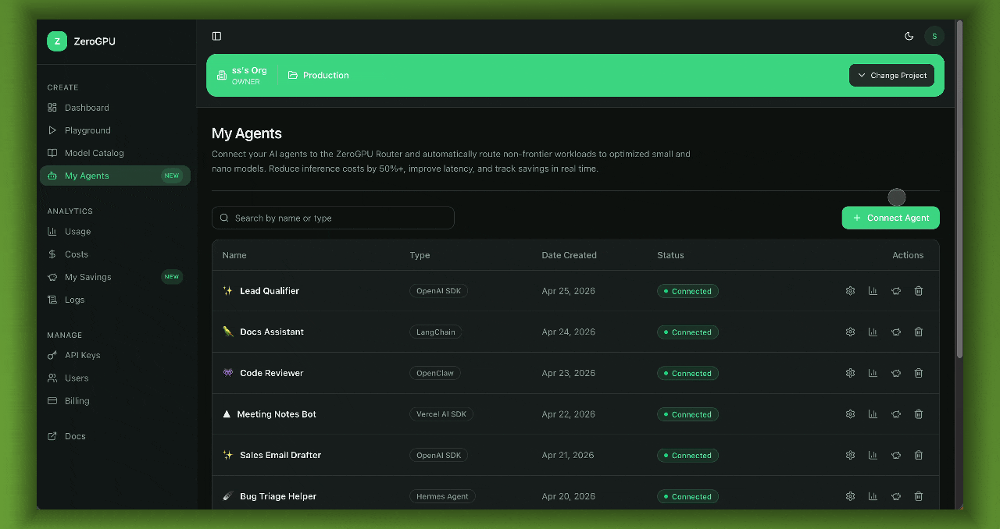

# ZeroGPU Router

Cut your AI costs. Route trivial tasks — summarize, classify, redact PII, extract JSON, generate follow-ups, short chat — to small/nano models instead of burning frontier-model tokens.

[](README.md)
[](https://github.com/zerogpu/ZeroGPU-Router/actions/workflows/ci.yml)
[](LICENSE)
[](agents/claude/)
[](agents/openclaw/)



## What is ZeroGPU Router?

ZeroGPU Router is a smart task router for AI agents. It exposes task-specific tools — summarize, classify, redact PII, extract JSON, and more — via the Model Context Protocol (MCP), backed by small language models that run for a fraction of the cost of a frontier model.

Your agent keeps doing the heavy reasoning. The boring stuff gets routed to ZeroGPU.

- **Plugs into your agent** — Claude Code or OpenClaw, in three commands.
- **Cheap by default** — small models for trivial work, frontier model untouched for everything else.
- **Per-call savings** — every routed task returns model, latency, and a real `savings_usd` figure.
- **Hosted, no infra** — point your agent at `https://mcp.zerogpu.ai/mcp`. We run the routing layer.

## Quick Start

You need a ZeroGPU API key and project ID. Grab them at [platform.zerogpu.ai](https://platform.zerogpu.ai).

### Claude Code

Register the hosted MCP endpoint:

```sh
claude mcp add --transport http zerogpu \
  https://mcp.zerogpu.ai/mcp \
  --header "x-api-key: <your-api-key>" \
  --header "x-project-id: <your-project-id>"
```

Install the routing skill so Claude knows *when* to use the tools — see [agents/claude/](agents/claude/).

Restart Claude Code and try:

```text
summarize this paragraph: Renewable energy adoption is accelerating globally, driven by falling solar and wind costs.
```

Claude will call `zerogpu_summarize` and reply with a summary plus a savings line.

### OpenClaw

Register the hosted MCP endpoint in OpenClaw:

```sh
openclaw mcp set zerogpu '{
  "url": "https://mcp.zerogpu.ai/mcp",
  "transport": "streamable-http",
  "headers": {
    "x-api-key": "<your-api-key>",
    "x-project-id": "<your-project-id>"
  }
}'
```

Install the routing skill — full instructions in [agents/openclaw/](agents/openclaw/).

Then ask your agent the same prompt above. The agent will call `zerogpu_summarize` instead of answering with the host model.

## Cloud connection

Sign in at **[platform.zerogpu.ai](https://platform.zerogpu.ai)** to:

- Generate API keys and project IDs
- Watch live token usage, latency, and routed-call savings on the dashboard
- See per-tool savings broken down by agent and time range
- Manage agents, billing, and team access
- Follow the step-by-step connect-your-agent guide for Claude Code and OpenClaw

The hosted Router at `https://mcp.zerogpu.ai/mcp` is the one your agent talks to. The dashboard at `platform.zerogpu.ai` is where you see what it did.

## Routes

ZeroGPU Router exposes eleven task-specific routes:

| Route | Workload | Model |
|---|---|---|
| `zerogpu_classify_iab` | IAB topic classification | `zlm-v1-iab-classify-edge` |
| `zerogpu_summarize` | TL;DRs, abstracts, meeting note summaries | `t5-small` |
| `zerogpu_classify_zero_shot` | Classify against a flat label list | `deberta-v3-small` |
| `zerogpu_extract_entities` | Extract people, places, companies, dates, custom entities | `gliner2-base-v1` |
| `zerogpu_extract_json` | Pull structured fields into grouped JSON | `gliner2-base-v1` |
| `zerogpu_classify_structured` | Multi-axis schema classification | `gliner2-base-v1` |
| `zerogpu_redact_pii` | Mask emails, phones, names, addresses, other PII | `gliner-multi-pii-v1` |
| `zerogpu_extract_pii` | Extract PII grouped by category | `gliner-multi-pii-v1` |
| `zerogpu_generate_followups` | Generate follow-up questions from a passage | `zlm-v1-followup-questions-edge` |
| `zerogpu_chat` | Short small-model chat replies | `LFM2.5-1.2B-Instruct` / `-Thinking` |
| `zerogpu_health` | Verify ZeroGPU backend health | — |

Every route returns `{ <task fields>, model, usage, savings }`.

## Packages

| Package | Role |
|---|---|
| [agents/claude/](agents/claude/) | Claude Code marketplace plugin + routing skill |
| [agents/openclaw/](agents/openclaw/) | OpenClaw plugin (`openclaw-package-zerogpu`) + routing skill + MCP registration JSON |

## Quick Links

- [Claude Code setup](agents/claude/README.md)
- [OpenClaw setup](agents/openclaw/README.md)
- [Agent integrations index](agents/README.md)
- [Platform dashboard](https://platform.zerogpu.ai)
- [Release guide](RELEASE.md)
- [Contributing](CONTRIBUTING.md)
- [Security](SECURITY.md)
- [License](LICENSE)
